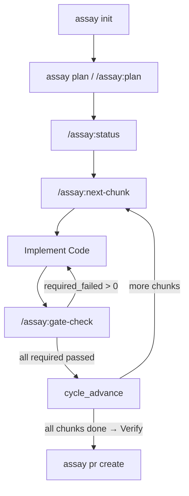
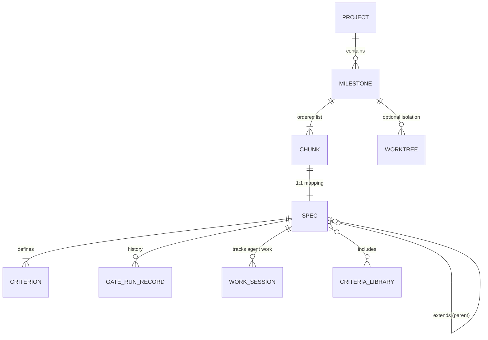
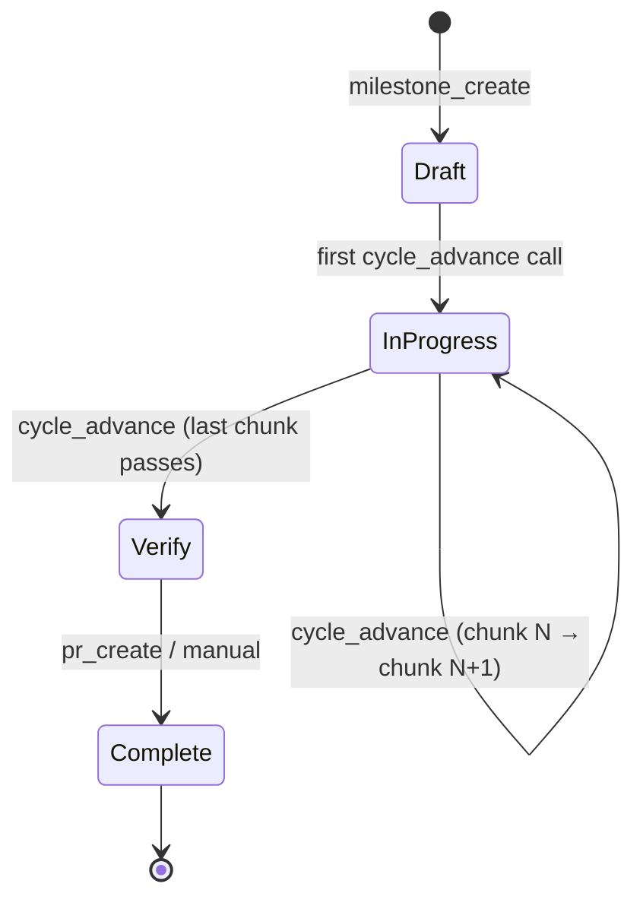
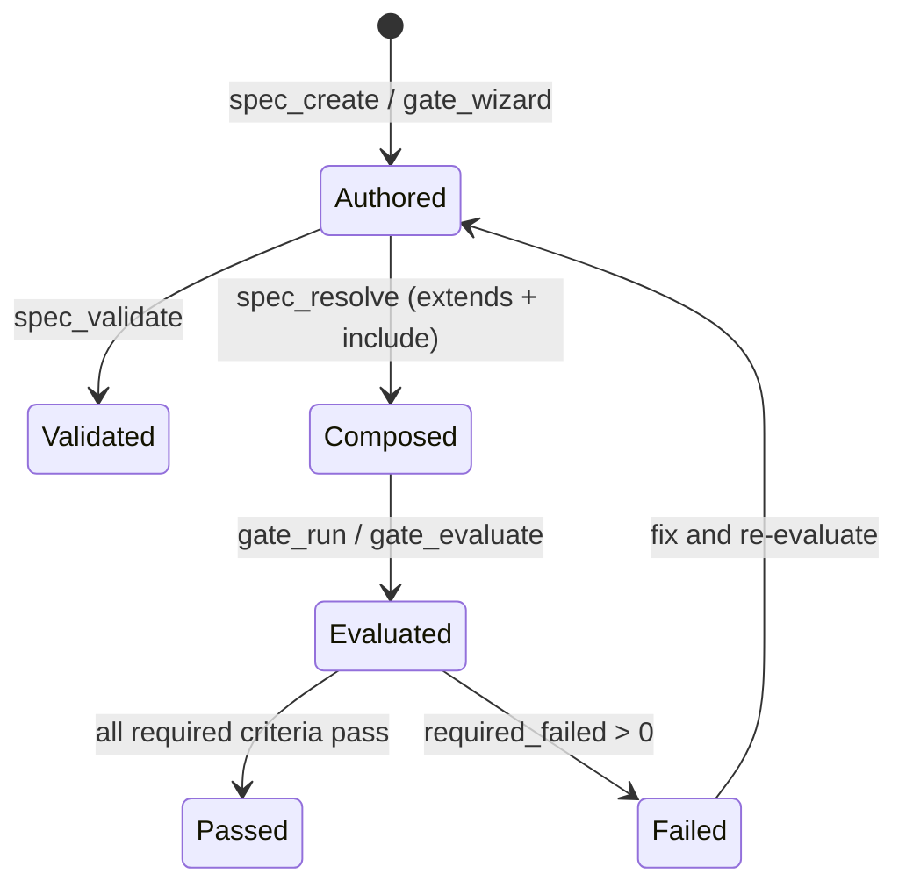
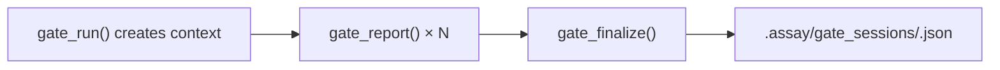
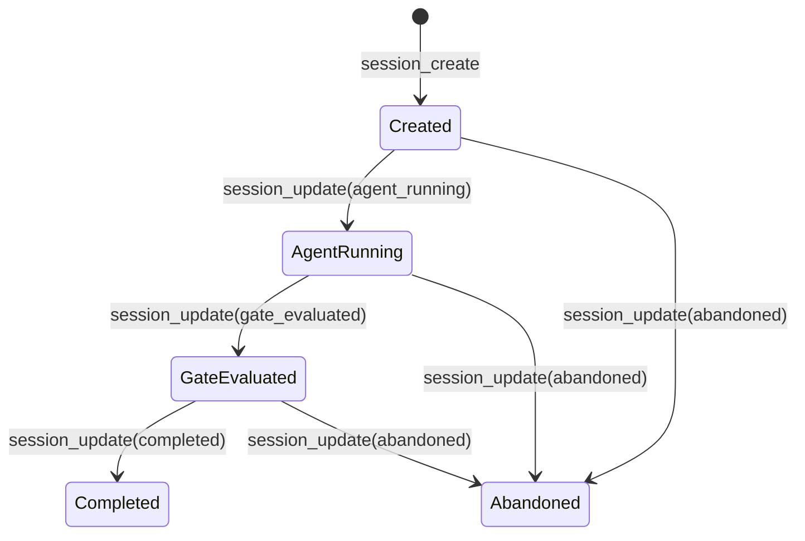
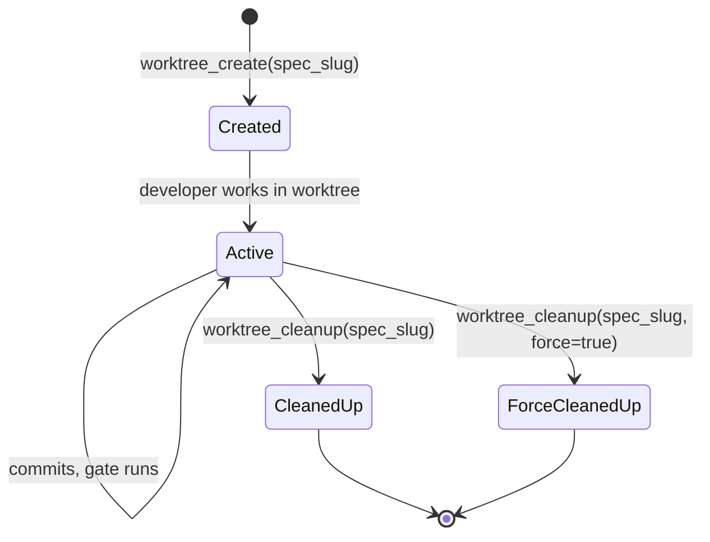
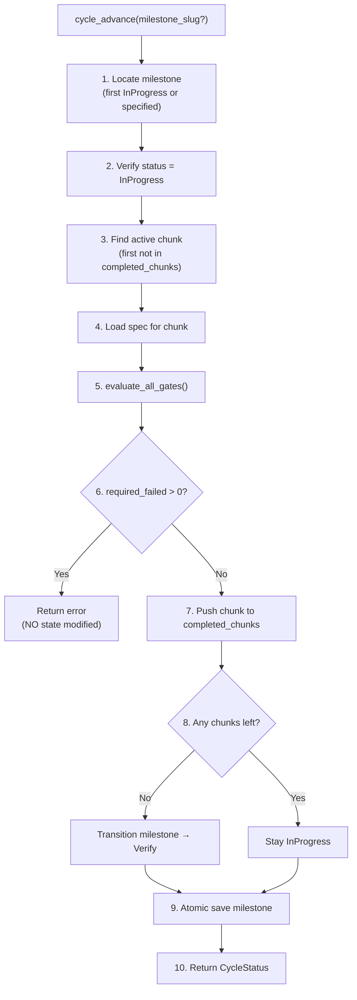
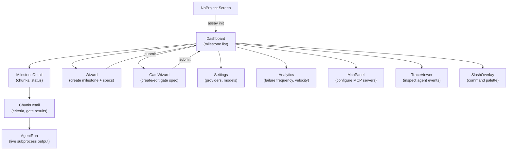

# Assay Workflow: Current State

This document captures how Assay's workflow operates today, as implemented in the codebase.

---

## High-Level Flow

---

## Concept Hierarchy

**Nouns a user encounters:**
Project, Milestone, Chunk, Spec, Criterion, Gate, Cycle, Session, Worktree, Harness, Criteria Library, Precondition

---

## Milestone Lifecycle

**Persistence:** `.assay/milestones/<slug>.toml`

| Field | Purpose |
|-------|---------|
| slug | Unique ID (from filename) |
| name | Display name |
| status | Draft / InProgress / Verify / Complete |
| chunks | Ordered `Vec<ChunkRef>` (slug, name, order) |
| completed_chunks | `Vec<String>` of finished chunk slugs |
| created_at, updated_at | Timestamps |
| pr_number, pr_url | Populated after PR creation |

---

## Spec Lifecycle

**Format:** `.assay/specs/<slug>/gates.toml` (directory format, current)

**Composition Model:**
- `extends`: Single parent gate spec (inheritance chain)
- `include`: Multiple criteria library slugs (flat union)
- Resolution order: own criteria > included > extended

**Criterion Types:**

| Kind | Evaluated By | Requires |
|------|-------------|----------|
| Command | Shell subprocess | `cmd` field |
| FileExists | Path check | `path` field |
| AgentReport | AI agent | `prompt` field |
| EventCount | Pipeline events | Pipeline context |
| NoToolErrors | Pipeline events | Pipeline context |

---

## Gate Evaluation (Three Paths)

```mermaid
flowchart TD
    subgraph path1["Path 1: Synchronous (Commands)"]
        p1_start["gate_run(spec)"] --> p1_eval["evaluate_all()"]
        p1_eval --> p1_result["GateRunSummary"]
        p1_result --> p1_save["Persist to history"]
    end

    subgraph path2["Path 2: Agent Self-Eval (Manual)"]
        p2_start["gate_run(spec)"] --> p2_ctx["GateEvalContext created"]
        p2_ctx --> p2_report["gate_report() × N"]
        p2_report --> p2_final["gate_finalize()"]
        p2_final --> p2_save["Persist to history"]
    end

    subgraph path3["Path 3: Evaluator Subprocess (Automated)"]
        p3_start["gate_evaluate(spec)"] --> p3_spawn["Spawn headless claude"]
        p3_spawn --> p3_parse["Parse JSON output"]
        p3_parse --> p3_save["Persist to history"]
    end

    style path1 fill:#e8f5e9
    style path2 fill:#fff3e0
    style path3 fill:#e3f2fd
```

**When each path is used:**

| Path | Trigger | Criteria Supported | Solo Relevance |
|------|---------|-------------------|----------------|
| 1 - Synchronous | `/gate-check`, `cycle_advance` | Command, FileExists | High (90% case) |
| 2 - Manual agent | MCP `gate_run` with AgentReport criteria | AgentReport (multi-step) | Medium |
| 3 - Evaluator subprocess | MCP `gate_evaluate` | All types via LLM | Low (headless/pipeline) |

**History Persistence:** `.assay/history/<spec_name>/<run_id>.json`

---

## Session Lifecycle

### GateEvalContext (Ephemeral)

Created by `gate_run()` when a spec has `AgentReport` criteria. Lives in memory during evaluation.

- Eviction: 50 most recent retained
- No phase state machine — linear create → report → finalize

### WorkSession (Persistent)

Created by `session_create()` for long-running agent work. Tied to a spec and worktree.

**Persistence:** `.assay/sessions/<session_id>.json` (ULID-based)

**Fields:** id, spec_name, worktree_path, phase, transitions (audit trail), agent (command + model), gate_runs (linked IDs), tool_call_summary, assay_version

**Gap:** No retention limits. Sessions accumulate indefinitely.

---

## Worktree Lifecycle

**Persistence:** `.assay/worktrees/<spec_slug>/` directory + `.assay/worktree.json` metadata inside

**Branch:** `assay/<spec_slug>` based off detected default branch (or user-specified base)

**Gap:** No automatic cleanup. No retention limits.

---

## cycle_advance Algorithm

**Key property:** Steps 1-6 are read-only. Gate failure leaves milestone untouched.

---

## TUI Screen Graph

---

## Plugin Skill Surface (Claude Code)

| Skill | Purpose | MCP Tools Used |
|-------|---------|----------------|
| `/assay:plan` | Interview → create milestone + chunk specs | `milestone_create`, `spec_create` |
| `/assay:status` | Show active milestone, phase, progress | `cycle_status` |
| `/assay:next-chunk` | Load active chunk criteria + gate status | `cycle_status`, `chunk_status`, `spec_get` |
| `/assay:spec-show` | Display spec criteria | `spec_list`, `spec_get` |
| `/assay:gate-check` | Run gates, report results | `gate_run` (path 1 only) |

**Gap:** `/gate-check` only uses `gate_run` (path 1). AgentReport criteria are skipped, not evaluated.

---

## Data Retention Summary

| Data | Location | Retention | Eviction |
|------|----------|-----------|----------|
| Milestones | `.assay/milestones/` | Indefinite | None |
| Specs | `.assay/specs/` | Indefinite | None |
| Gate history | `.assay/history/` | Indefinite | None |
| Gate eval contexts | `.assay/gate_sessions/` | 50 most recent | Auto-evict on new session |
| Work sessions | `.assay/sessions/` | Indefinite | None |
| Worktrees | `.assay/worktrees/` | Indefinite | Manual cleanup only |
| Criteria libraries | `.assay/criteria/` | Indefinite | None |
| Traces | `.assay/traces/` | Indefinite | None |
