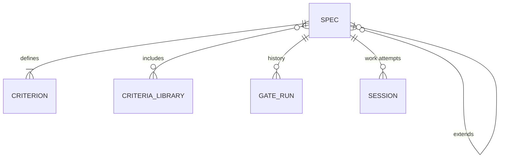
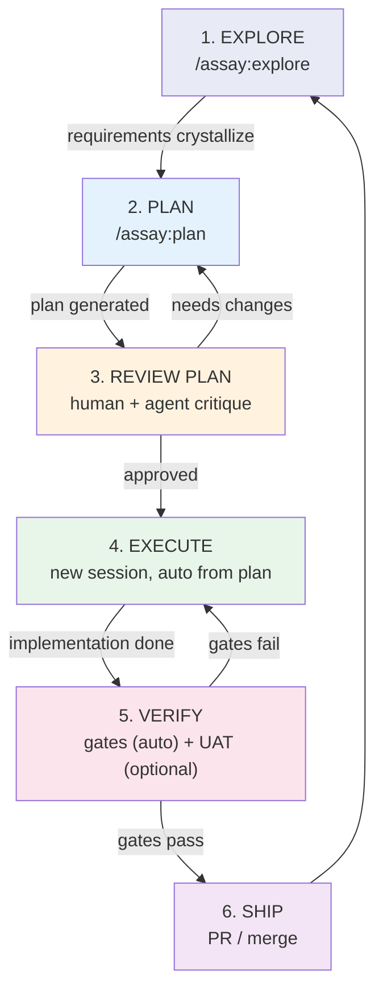
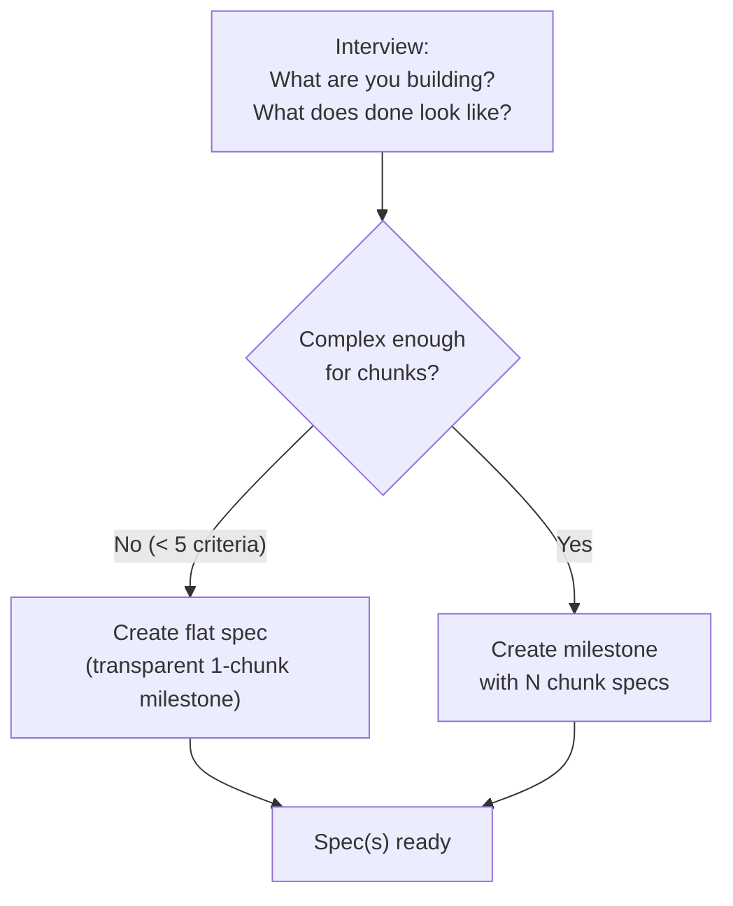
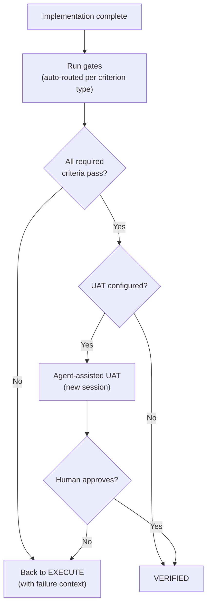
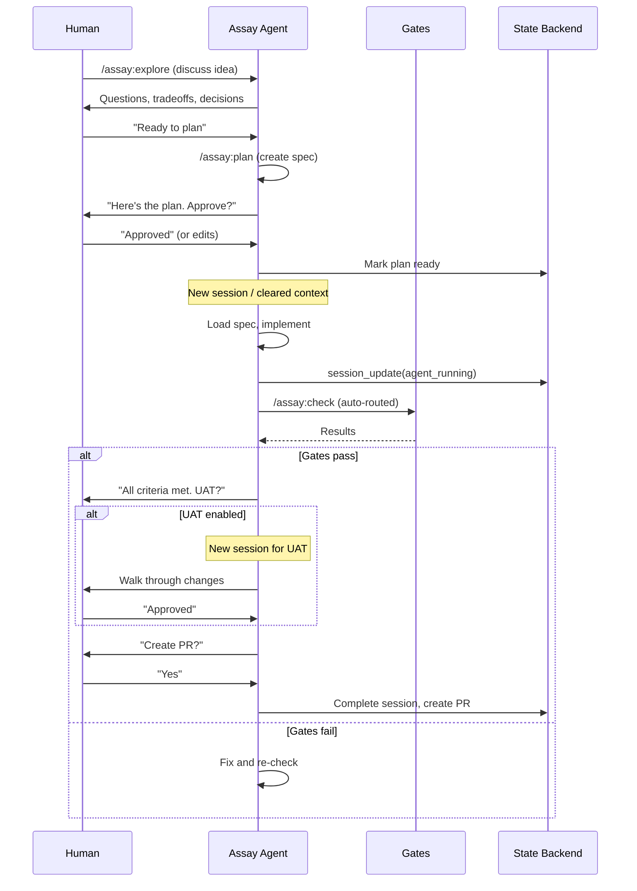
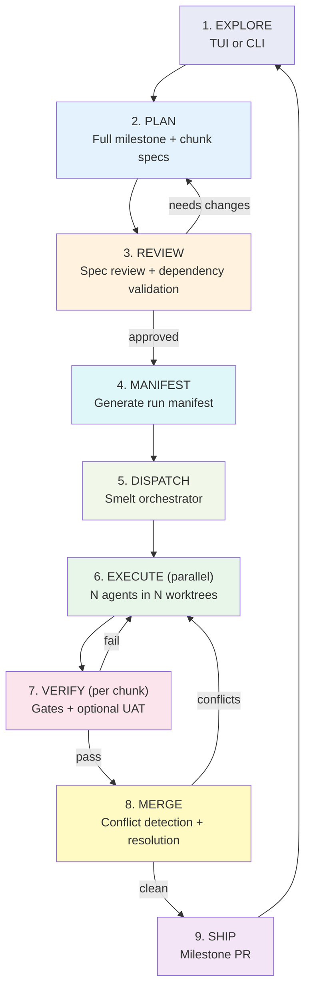
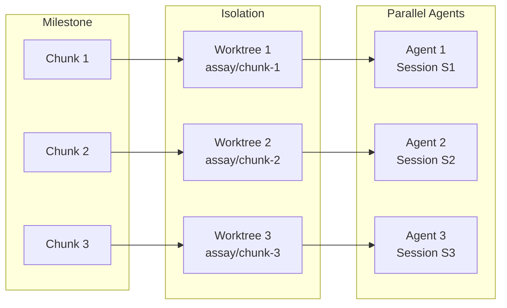
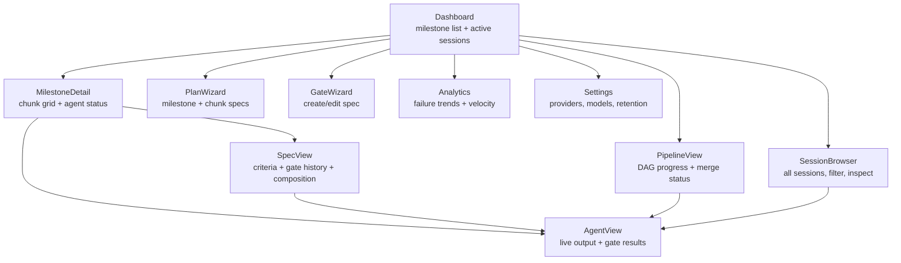
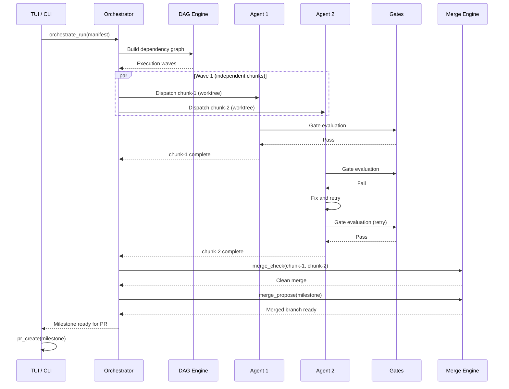
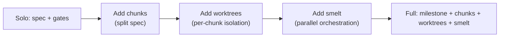

# Assay Workflow: Desired State

Two workflow modes sharing a common foundation. The solo workflow is the stripped-down path for one developer, one project, one session at a time. The full workflow adds orchestration, parallel agents, and TUI-driven multi-session management via smelt.

---

## Shared Foundation

Both workflows are built on the same primitives:



**Core nouns (both modes):** Spec, Criterion, Gate

**Additional nouns (full mode only):** Milestone, Chunk, Worktree, Session, Manifest, Pipeline

---

## Solo Developer Workflow

### Philosophy

- Specs are first-class, standalone units — not subordinate to milestones
- A spec can function as its own mini-milestone (transparent wrapper if needed for cycle mechanics)
- The flow is autonomous: phases transition automatically with human checkpoints at decision points
- Gates are the machine-verifiable backbone — the defining feature of Assay

### Phase Flow



### Phase Details

#### 1. EXPLORE (`/assay:explore`)

**Purpose:** Thinking partner. Brainstorm requirements, investigate the codebase, compare approaches, make architectural decisions (clean arch vs N-layer, monorepo vs single repo, package choices).

**What happens:**

- Conversational — no fixed structure
- Agent reads code, asks questions, surfaces tradeoffs
- Architectural decisions captured as they're made
- Research can happen here (docs, library comparison)

**Output:** Clarity on what to build and key decisions. Optionally captured as notes/context.

**Transition:** User says "I know what I want" or the conversation naturally crystallizes into requirements.

#### 2. PLAN (`/assay:plan` or `assay plan quick`)

**Purpose:** Turn explored requirements into a concrete spec with verifiable criteria.

**What happens:**

- Interview: goal, acceptance criteria, optional chunk decomposition
- For simple work: flat spec (no milestone/chunk wrapper visible to user)
- For larger work: chunked spec (milestone created transparently)
- Each criterion is tagged with evaluation type (command, file check, agent report)

**Output:** Spec file(s) in `.assay/specs/` with full criteria.

**Transition:** Plan generated → automatically moves to review.



#### 3. REVIEW PLAN

**Purpose:** Catch issues before execution. Human approval gate.

**What happens:**

- Agent critiques the plan: missing edge cases, unclear criteria, scope creep
- Human reviews and can edit spec directly
- Criteria can be refined, added, removed
- Plan marked "ready for execution" when approved

**Output:** Approved spec(s) with finalized criteria.

**Transition:** Human marks plan as ready → new session spawns for execution.

#### 4. EXECUTE

**Purpose:** Implement the code to satisfy spec criteria.

**What happens:**

- Fresh context window (new session or subagent)
- Spec criteria loaded automatically at session start
- Agent implements, guided by criteria
- Session state tracked (Created → AgentRunning) transparently

**Key design:** Execution happens in a clean context. The plan IS the handoff — no conversation history needed. The spec is the contract.

**Transition:** Agent signals implementation complete → automatic gate evaluation.

#### 5. VERIFY

**Purpose:** Machine-verifiable proof that code meets spec. Optional human verification.

**What happens:**

- **Gates (automatic):** Smart routing — picks the right evaluation path per criterion:
  - Command criteria → shell subprocess (path 1)
  - AgentReport criteria → evaluator subprocess or in-session report (path 2/3, chosen by config)
  - All results persisted to history
- **UAT (optional):** Agent-assisted human verification in a new session
  - Human walks through functionality with agent assistance
  - Agent surfaces relevant gate results and criteria
  - Human confirms or rejects



**Transition:** All gates pass (+ optional UAT) → ship.

#### 6. SHIP

**Purpose:** Get verified code into the main branch.

**What happens:**

- Auto-prompt: "All criteria met. Create PR?"
- Gate results included in PR body as evidence
- If chunked: advance cycle to next chunk and loop back to execute
- If last chunk / flat spec: milestone complete

**Transition:** PR merged → back to explore for next piece of work.

---

### Solo Skill Surface (Desired)

| Skill               | Purpose                                                | Replaces                              |
| ------------------- | ------------------------------------------------------ | ------------------------------------- |
| `/assay:explore`    | Thinking partner, requirements discovery               | (new)                                 |
| `/assay:plan`       | Create spec from requirements                          | `/assay:plan` (simplified)            |
| `/assay:plan quick` | Flat spec, no chunks, minimal ceremony                 | (new)                                 |
| `/assay:focus`      | Show current spec criteria + gate status               | `/assay:next-chunk` + `/assay:status` |
| `/assay:check`      | Smart gate evaluation (auto-routes all criteria types) | `/assay:gate-check` (expanded)        |
| `/assay:ship`       | Gate-gated PR with evidence                            | (new, wraps `pr_create`)              |

**Removed from solo surface:** `/assay:next-chunk` (merged into `/assay:focus`), `/assay:status` (merged into `/assay:focus`)

---

### Solo Autonomous Flow



---

## Full Workflow (TUI + Smelt Orchestration)

### Philosophy

- Everything from solo, plus parallel execution and multi-session management
- TUI is the control plane — dashboard, not just a viewer
- Milestones and chunks are explicit, first-class concepts (not hidden)
- Worktrees provide git isolation per agent/chunk
- Sessions are visible and manageable
- Smelt handles the DAG: dependencies, ordering, parallel dispatch

### Phase Flow



### Additional Concepts (Full Mode)



### TUI Screen Graph (Desired)



### Smelt Orchestration Flow



---

## Comparison: Solo vs Full

| Aspect               | Solo                                              | Full                                                                                      |
| -------------------- | ------------------------------------------------- | ----------------------------------------------------------------------------------------- |
| **Entry point**      | `/assay:explore` → `/assay:plan`                  | TUI dashboard → PlanWizard                                                                |
| **Spec granularity** | Flat spec (optional chunks)                       | Milestone with chunked specs                                                              |
| **Execution**        | Single agent, main branch                         | N agents, N worktrees                                                                     |
| **Gate routing**     | Auto (transparent)                                | Auto + configurable per criterion                                                         |
| **Session tracking** | Transparent (free)                                | Explicit, visible in TUI                                                                  |
| **Worktrees**        | Optional                                          | Required per chunk                                                                        |
| **Merge**            | Direct commit/PR                                  | Conflict detection + resolution                                                           |
| **UAT**              | Optional, agent-assisted                          | Optional, per-chunk or per-milestone                                                      |
| **State machine**    | explore → plan → review → execute → verify → ship | + manifest → dispatch → parallel execute → merge                                          |
| **Concept count**    | 3 visible (spec, criteria, gate)                  | 10+ (milestone, chunk, spec, criterion, gate, session, worktree, manifest, pipeline, DAG) |

---

## Transition Path: Solo → Full

A solo developer using the simple workflow should be able to upgrade without starting over:

1. **Flat specs work in milestones** — a flat spec is just a 1-chunk milestone
2. **Session history carries over** — all gate runs, sessions, and history persist
3. **Worktrees are additive** — adding isolation to existing specs doesn't break anything
4. **Config grows, doesn't change** — solo config is a subset of full config



---

## Resolved Decisions

### 1. `/assay:explore` — Skill for solo, TUI screen for full

Explore is fundamentally conversational — no structured input/output, so an MCP tool doesn't fit. The skill loads context (existing specs, codebase structure, config) and then it's conversation with Assay-awareness. For TUI: a dedicated screen where explore notes persist and feed into plan creation.

**Key principle:** Surface-agnostic state. Users can switch between skill/plugin in their harness of choice (Claude Code, Codex, OpenCode) and the Assay CLI/TUI with no loss of data or workflow state. Progressive improvement with graceful fallback to simple skill-based workflow.

### 2. Plan review — Spec status field with auto-promotion

Add `status` field to `gates.toml` with defined enum values:

```
draft → ready → approved → (gate pass) → verified
```

- Specs start as `draft` when created
- Human marks `ready` after review
- Approved by human or agent critique → `approved`
- Gate run with all-pass result auto-promotes to `verified`
- Queryable: "which specs are still draft?" / "which are verified?"

No separate approval artifact. The status is metadata about the spec, not a separate concern.

### 3. Auto-advance — State machine in core + signal emission for smelt

`assay-core` gets `workflow::next_action()` that takes current state and returns the next action (advance chunk, prompt for UAT, prompt for PR, etc.). Plugin skills and TUI consume this — the decision logic lives in one place, is testable in isolation.

For smelt orchestration: gate completion also emits a signal that the orchestrator can subscribe to. The state machine (B) is the primary mechanism; signals (C) are the notification layer on top.

```rust
// Conceptual API
enum NextAction {
    AdvanceChunk { next_chunk: String },
    PromptUat { spec_name: String, gate_run_id: String },
    PromptPr { milestone_slug: String },
    FixAndRecheck { failed_criteria: Vec<String> },
    Complete,
}

fn next_action(assay_dir: &Path) -> Result<NextAction>;
```

### 4. UAT handoff — spec_name + gate_run_id

The UAT session loads three things, all already persisted:
- **Spec** (what to verify) — on disk in `.assay/specs/`
- **Gate results** (what passed/failed) — in `.assay/history/`
- **Diff** (what changed) — from git

No direct session-to-session linkage needed. The spec is the contract, the gate run is the evidence. State backend (file, Linear, etc.) holds all necessary data.

### 5. Session retention — Count + age, lazy eviction

Configurable in `.assay/config.toml`:

```toml
[sessions]
max_count = 100       # keep N most recent
max_age_days = 90     # delete older than N days
```

Whichever limit is hit first wins. Cleanup runs lazily (on `session_create` or `session_list`), not via background daemon. Same pattern as the existing GateEvalContext eviction (50 most recent), extended to WorkSessions with user-configurable limits.

### 6. `assay plan quick` — Transparent 1-chunk milestone + config-driven branch isolation

**Milestone:** Transparent 1-chunk milestone. Cycle mechanics (cycle_status, cycle_advance, gate history) all assume a milestone exists. Create it silently — user sees `Spec: add-dark-mode (5 criteria)`, never `Milestone: add-dark-mode, Chunk 1 of 1`.

**Branch/worktree strategy:** Config-driven with smart default.

```toml
[workflow]
auto_isolate = "ask"  # "always" | "never" | "ask"
```

Behavior:
- `"ask"` (default for solo): If on a protected branch (main/develop/master), prompt "Create a branch for this work?". If already on a feature branch, proceed without asking.
- `"always"` (default for full/smelt): Silently create a worktree.
- `"never"`: Work on current branch, no questions asked.

This covers the 90% case: solo devs on a feature branch get zero friction, solo devs on main get a safety prompt, full mode always isolates.

### 7. Gate evidence — Full results, surface-adapted rendering

The gate result data structure is the same everywhere. Rendering adapts per surface:

| Surface | Rendering |
|---------|-----------|
| Terminal / CLI | 1-line summary |
| Claude Code plugin | Collapsed detail block |
| TUI | Expandable panel |
| PR body | Summary + run ID link |
| PR check run / comment | Full criterion-by-criterion, collapsible sections |

Gate results as check run / PR comment ships out of the box — smelt orchestration depends on forge PRs and needs the full detail. Terminal and in-agent surfaces parse/collapse the same data for minimal output.
